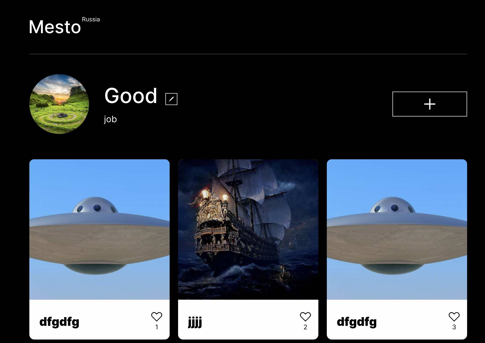

# Проект: Mesto

------------------

[Ссылка на проект](https://thebarbakov.github.io/mesto/)

------------------

Проект Mesto. Интерактивная страница, куда можно добавлять фотографии, удалять их и ставить лайки.

------------------

## Обновления

1. _UPD Project V:_ Добавлена возможность добавлять карточки, удалять карточки, открывать их в полный экран, ставить лайки, добавлены анимации для окон.
2. _UPD Project VI:_ Добавлена валидация форм. Стало возможным закрывать попап'ы кликом на оверлей.
3. _UPD Project IX:_ Проект подключен к серверу.
4. _UPD Project X:_ Проект портирован на React.

------------------

## Основные блоки

1. Профиль
2. Фотографии

------------------

## Использованные технологии

* HTML 5.3
* CSS3
* JavaScrypt
* React

------------------

## Планы по доработке проекта

1. ~~Доработать функцию выгрузки фотографий.~~ - Project V +
2. ~~Доработать функцию возмонжости ставить лайки.~~ - Project V +
3. ~~Добавить валилацию форм.~~ - Project VI +
4. ~~Подключить проект к серверу для его полного функционирования.~~ - Project IX +
